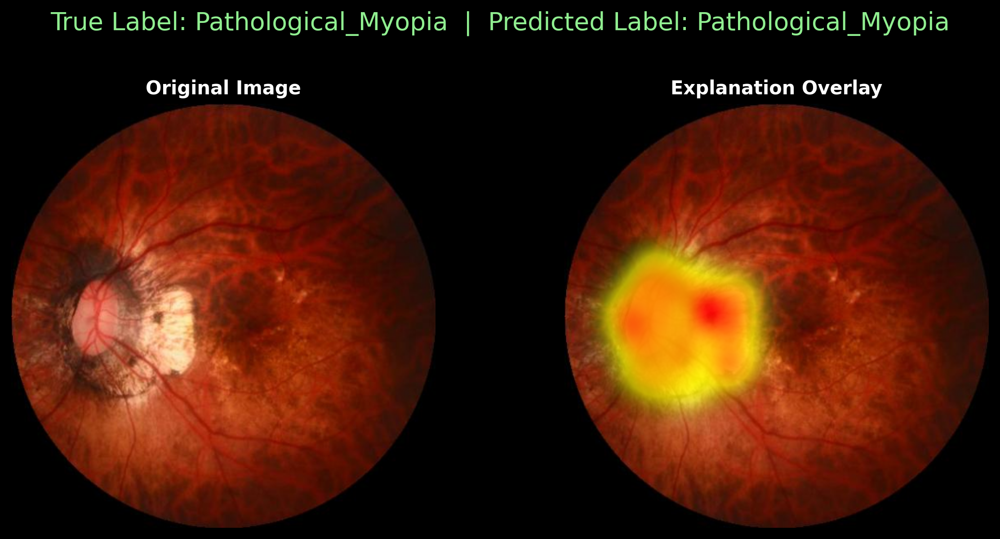

# myopia-classification-dinov2

**Classification of Myopia in Fundus Images using DINOv2 ViT and XAI**

This repository contains the official implementation for the research project on classifying fundus images into three classes: **Normal, High Myopia, and Pathological Myopia**. The primary model is a **Vision Transformer (ViT)** pre-trained with the **DINOv2 self-supervised learning** method.

For comparison, this project also implements and evaluates several baseline CNN architectures: **ResNet50, EfficientNet-B3, and VGG16**. A key focus of this research is on **model explainability**, generating high-accuracy attention maps to understand the ViT's decision-making process.



---

## Key Features

* **State-of-the-Art Model**: Utilizes the powerful **DINOv2 ViT-B/14** model, fine-tuned for the specific task of myopia classification.
* **Comparative Analysis**: Provides a full training and evaluation pipeline for baseline models including **ResNet50, EfficientNet-B3, and VGG16**.
* **Robust Training Strategy**: Implements a rigorous training setup with:

  * **10-fold stratified cross-validation** for reliable evaluation.
  * **Two-stage fine-tuning** (training the head, then the full model with differential learning rates).
  * **Focal Loss with Label Smoothing** to handle potential class imbalance.
  * **Class-balanced sampling** (`WeightedRandomSampler`) during training.
* **Advanced Evaluation**:

  * Employs **Test-Time Augmentation (TTA)** for robust predictions on the final test set.
  * Generates a comprehensive suite of evaluation plots, including **ROC curves, Precision-Recall curves, confusion matrices, and per-class metrics reports**.
* **High-Accuracy Explainability (XAI)**:

  * Includes a dedicated script (`explain_models.py`) to generate **high-fidelity attention maps** using a **Dual-Rollout Attention method**, providing clear visual explanations for the ViT's predictions.

---

## Results

The **DINOv2 ViT** model achieved the **highest performance across all key metrics**, demonstrating the effectiveness of self-supervised pre-training for this medical imaging task.

Detailed performance tables comparing all four models are generated by the script:

```bash
python src/generate_tables_plotly.py
```

<!-- You can add an image of your results table here -->

---

## Setup and Installation

1. **Clone the repository:**

```bash
git clone https://github.com/Christos-Tsoutsas/myopia-classification-dinov2.git
cd myopia-classification-dinov2
```

2. **Create a virtual environment (recommended):**

```bash
python3 -m venv venv
source venv/bin/activate
```

3. **Install dependencies:**

The required packages are listed in `requirements.txt`. Install them using:

```bash
pip install -r requirements.txt
```

4. **Data Organization:**

Place your dataset in the `data/` directory, organized by class:

```
data/
├── Normal/
│   ├── image1.jpg
│   └── ...
├── High_Myopia/
│   ├── image2.jpg
│   └── ...
└── Pathological_Myopia/
    ├── image3.jpg
    └── ...
```

---

## Usage

The main training scripts are located in the `src/` directory. You can run an experiment for any of the implemented models.

### Training a Model

To run the main experiment with the **DINOv2** model:

```bash
python src/DINOv2_regularized.py
```

This script will automatically handle:

* **10-fold cross-validation**
* Saving the **best model** from each fold to `outputs/models/`
* Generating all **evaluation plots** in `outputs/reports/`

To train one of the other models, run its corresponding script:

```bash
# For ResNet50
python src/ResNet50.py

# For EfficientNet-B3
python src/EfficientNet-B3.py

# For VGG16
python src/VGG16.py
```

The scripts will create separate `reports_*` and `models_*` directories for each experiment.

---

### Generating Explainability Maps

After training the **DINOv2 model**, generate the attention-based explanations for images in your test set:

```bash
python src/explain_models.py
```

This will save the explanation images to:

```
outputs/reports/reports_experiment_REG1/explainability_high_accuracy/
```

---

## License

This project is licensed under the **MIT License**. See the [LICENSE](LICENSE) file for details.
